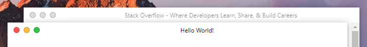
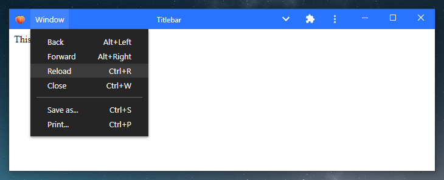

# custom-titlebar

Poorly coded titlebar for [Electron](https://www.electronjs.org/), [NW.js](https://nwjs.io/) and [PWAs](https://developer.mozilla.org/en-US/docs/Web/Progressive_web_apps).

  


> Light/Dark skin



> Control button styles

<details>
<summary>Show me more</summary>


> Condensed menu



> Progressive web app

</details>

# About

**It's a library for Electron, NW.js and PWAs, it can be used on a basic website but it's useless ¯\\_(ツ)_/¯**

## Main features

* Compatible with any version of Electron 🎉
* Works with Electron, NW.js and probably others 🤷‍♂️
* Fully compatible with Progressive Web Apps and Window Controls Overlay 🔥
* Works without any dependencies, so it won't break in the next major release of Electron 👀
* Very small footprint (< 30 kB) 👣
* Options and methods very similar to [custom-electron-titlebar](https://www.npmjs.com/package/custom-electron-titlebar) 📖

## Inpiration

This package is highly inspired by [custom-electron-titlebar](https://www.npmjs.com/package/custom-electron-titlebar).

## Motivations

I needed a custom titlebar for Electron 14 to replace the unmaintained [custom-electron-titlebar](https://www.npmjs.com/package/custom-electron-titlebar), but I couldn't find any interesting ones, so I made it myself.

## Not yet implemented

* ~~MenuItem role, icon, radio~~ Done!
* ~~Icons theme~~ Done!
* Submenu scrollbar
* Keyboard controls

# Q&A

## Can I use this package without `@electron/remote`?

Absolutely! Check out the [advanced examples](https://github.com/6c65726f79/custom-titlebar/wiki/Advanced-examples#use-without-electronremote) to see how it's done.

## How to fix Content Security Policy errors?

Simply add `style-src 'unsafe-inline'` in the `Content-Security-Policy` meta tag.

## How long before this package becomes unmaintained too?

This package doesn't rely on the Electron or NW.js API so it doesn't need as much maintenance as other packages. Even if I stop maintaining it and the API change dramatically, you could modify your code to match the new API. So theoretically this package can't become obsolete.

# Install

```
npm i @6c65726f79/custom-titlebar
```

# Usage

## JavaScript

```javascript
const Titlebar = require('@6c65726f79/custom-titlebar');

new Titlebar({
  backgroundColor: '#000'
});
```

## TypeScript

```typescript
import Titlebar from '@6c65726f79/custom-titlebar';

new Titlebar({
  backgroundColor: '#000'
});
```

# Examples

See the Wiki for more [advanced examples](https://github.com/6c65726f79/custom-titlebar/wiki/Advanced-examples).

## Electron

### main.js

```javascript
const { initialize, enable } = require('@electron/remote/main');
const { app, BrowserWindow } = require('electron');
const path = require('path');

initialize();

function createWindow () {
  const win = new BrowserWindow({
    width: 800,
    height: 600,
    frame: false,
    titleBarStyle: 'hidden',
    webPreferences: {
      contextIsolation: true,
      preload: path.join(__dirname, 'preload.js')
    }
  })

  enable(win.webContents);
  
  win.loadFile('index.html');
}

app.whenReady().then(() => {
  createWindow();
})
```

### preload.js

```javascript
const { Menu, getCurrentWindow } = require('@electron/remote');
const Titlebar = require('@6c65726f79/custom-titlebar');
const { platform } = require('process');

const currentWindow = getCurrentWindow();
let titlebar;

currentWindow.webContents.once('dom-ready', () => {
  titlebar = new Titlebar({
    menu: Menu.getApplicationMenu(),
    backgroundColor: '#37474f',
    platform: platform,
    browserWindow: currentWindow, /* Only needed if you use MenuItem roles */
    onMinimize: () => currentWindow.minimize(),
    onMaximize: () => currentWindow.isMaximized() ? currentWindow.unmaximize() : currentWindow.maximize(),
    onClose: () => currentWindow.close(),
    isMaximized: () => currentWindow.isMaximized()
  });
});
```

## NW.js

### package.json

```json
{
  "name": "helloworld",
  "main": "index.html",
  "window": {
    "frame": false,
    "toolbar": false
  },
  "dependencies": {
    "@6c65726f79/custom-titlebar": "^0.2.0"
  }
}
```

### index.html

```html
<!DOCTYPE html>
<html>
  <head>
    <title>Hello World!</title>
    <script src="./node_modules/@6c65726f79/custom-titlebar/lib/index.js"></script> 
  </head>
  <body>
    <h1>Hello World!</h1>
    <script>
      const gui = require('nw.gui');
      const { platform } = require('process');
      const win = gui.Window.get();
      let maximized = false;

      win.onMaximized.addListener(() => { maximized=true; });
      win.onRestore.addListener(() => { maximized=false; });

      const titlebar = new Titlebar({
        backgroundColor: '#37474f',
        platform: platform,
        onMinimize: () => win.minimize(),
        onMaximize: () => maximized ? win.restore() : win.maximize(),
        onClose: () => win.close(),
        isMaximized: () => maximized
      });
    </script>
  </body>
</html>
```

## Progressive Web App

### manifest.webmanifest

```json
{
  "background_color": "#2975ff",
  "description": "Progressive Web Application with a custom titlebar",
  "display": "standalone",
  "display_override": ["window-controls-overlay"],
  "icons": [],
  "name": "Progressive Web Application",
  "short_name": "custom-titlebar",
  "start_url": "./",
  "theme_color": "#2975ff"
}
```

### index.html

```html
<html>
    <head>
        <title>Titlebar</title>
        <script src="https://cdn.jsdelivr.net/npm/@6c65726f79/custom-titlebar/lib/index.js"></script>
        <link rel="manifest" href="manifest.webmanifest">
    </head>
    <body>
        <div id="app" style="padding:8px;">
            This is a web page
        </div>
        <script>
            const menu = [
              {
                label: 'File',
                submenu: [
                  {
                      label: 'Checkbox',
                      type: 'checkbox'
                  },
                  {
                      label: 'Checked state',
                      click: () => {
                          alert(menu[0].submenu.items[0].checked ? 'Checked' : 'Unchecked');
                      }
                  }
                ]
              }
            ];

            const titlebar = new Titlebar({
                windowControlsOverlay: true,
                backgroundColor:"#2975ff",
                unfocusEffect: false,
                menu
            });
        </script>
    </body>
</html>
```

# Options

All parameters are optional.

| Parameter                | Type       | Description                                                                  | Default          |
| ------------------------ | ---------- | ---------------------------------------------------------------------------- | ---------------- |
| backgroundColor          | `string`   | The background color of the titlebar.                                        | `#FFFFFF`        |
| browserWindow            | `object`   | The current `BrowserWindow`. **(Electron only)**                             | undefined        |
| condensed                | `boolean`  | Force the menu bar to be condensed.                                          | `false`          |
| drag                     | `boolean`  | Define whether or not you can drag the window.                               | `true`           |
| hideMenuOnDarwin         | `boolean`  | Hide the menu bar when the `platform` is `darwin`.                           | `true`           |
| height                   | `number`   | The height of the titlebar.                                                  | `30`             |
| icon                     | `string`   | The icon of the titlebar.                                                    | undefined        |
| isMaximized              | `function` | A function that return `true` or `false` if the window is maximized or not.  | undefined        |
| menu                     | `object`   | List of MenuItem to show in the menu bar. ([Electron](https://www.electronjs.org/docs/api/menu-item) or [NW.js](https://docs.nwjs.io/en/latest/References/MenuItem/)) | undefined        | 
| menuItemClickHandler     | `function` | A function that takes a `commandId` as parameter to handle menu item clicks. | undefined        |
| onClose                  | `function` | The function to call when the close button is clicked.                       | undefined        |
| onMaximize               | `function` | The function to call when the maximize/restore button is clicked.            | undefined        |
| onMinimize               | `function` | The function to call when the minimize button is clicked.                    | undefined        |
| overflow                 | `string`   | The overflow of the container. (`auto`, `visible`, `hidden`)                 | `auto`           |
| platform                 | `string`   | Style of the control buttons. (`win`, `darwin`)                              | `win`            |
| title                    | `string`   | Window title.                                                                | `document.title` |
| titleHorizontalAlignment | `string`   | Set horizontal alignment of the window title. (`left`, `center`, `right`)    | `center`         |
| unfocusEffect            | `boolean`  | Enables or disables the unfocus effect on the titlebar.                      | `true`           |
| windowControlsOverlay    | `boolean`  | Set this option to true if you're using [Window Controls Overlay](https://github.com/WICG/window-controls-overlay/blob/main/explainer.md). | `false`          |

# Methods

## Update options

This method updates all parameters that are specified.

```javascript
titlebar.updateOptions({
  condensed: 'true',
  titleHorizontalAlignment: 'left'
});
```

## Update background

This change the color of titlebar and it's checked whether the color is light or dark, so that the color of the icons adapts to the background of the titlebar. The value must be a valid CSS color.

```javascript
titlebar.updateBackground('rgb(60, 60, 60)');
```

## Update title

This method update the title of the titlebar. If you change the content of the title tag, you should call this method to update the title.

```javascript
document.title = 'My new title';
titlebar.updateTitle();

// Or you can do as follows and avoid writing document.title
titlebar.updateTitle('New Title');
```

## Update icon

With this method you can update the icon. This method receives the url of an image or an image encoded in base64.

```javascript
titlebar.updateIcon('data:image/png;base64,iVBORw0KGgoAAAANSUhEUgAAABAAAAAQCAYAAAAf8/9hAAAACXBIWXMAAAsTAAALEwEAmpwYAAAAIGNIUk0AAHolAACAgwAA+f8AAIDpAAB1MAAA6mAAADqYAAAXb5JfxUYAAAM8SURBVHjaPMzNaxxlHMDx7++ZZ2dfZjcvmjUvbd6axlZtVBJFEPEklYI3qQiKCr1bEEEontuTokcvVZRWREGhOdSCiK+9aECQ1Jg0qWmMm2w22czMzvs840n/gM9Hzn/wOM0jUE2niFPDTmudW6sbTFQe4OIzb81/uvjtqT915+O76keGhx2ceohdjmjUZ6iWx9FKC4XEY3F6+4wbdp9eb90Z2rhrNpfcmxfm+Hx6a5/Z6zvfoButk16m7OmJxuZoo7+rlAUFyAtvLxD7m+/d+bt9/p4+YWF8gamhhzh0PZKu9VW3o35zhrNXjk8enQ6kwx+9X9n0bl179NhjZ5sD87G8f+k10jhnMEy/fnao7/SR2QkYGQRdUIRenrZ9sZ2GolIFGiAW170lPlz+6HK9VjknxRdXoH/gZYK1T1j9DjIXGg5Fw0F0AfUG2T8+SpdRRQ5dD449ydqJk1dbuvOSOjRps9daeSdZ+oG81SX3DCZIwQ8pkgLsClm1RBTHMHgvRoT0py+ZabVffOr+V+e0cqqn862d+9g9IIt8xAalDJYliAKCEMupEaytUet3oK9M3iqR/fK9Kk3OPqeTzv68eCF5L4NehFQ11mGC1hqRAoljdL1KlhuS3V1sp4SqaGIvRG1vTGkT9ApjBIlyTJgBBcqHklZYJQsJIizxSJOc5NBHSxmTp2RJis5Mro1VuZkqG5MBCZgio7AMJQtKtmCVBCtKCA5DHKNIyxaJG5FWNNVyZVlLni3m1b6VUNdOSLgDgcEYIdaGsoBlDHmjwN33Gao4JF5M0AmRuWbLstRnKgn9mFrt9Xh0EtdYRL2YxM/ouQl+NyDzIw72fCI/RAS8VhePOsXAwJv++u22SlAAN/T4zLlgfIYuitBLyDxD5KfksaG97UIQ4rZ9tjqKZGTyYrTXudL5fQUtCGQpyrIu69lTu14QXwu31ygFGTYa7yBhb/uASpKxEgxhj41f6K/qS7nvURQFGgARiiTBUrKoRo+O9Gx9I3A7D1eCDulfexgjeMefcMvN8TMNJ/2Z1Ee0jfwfACJCkedIGu9Q73tEDY89L72DN7zV5SozD161mpPvluKeKdIYbPmP8e8AOU+pc9F7CmgAAAAASUVORK5CYII=');
```

## Update menu

This method updates or creates the menu. You can use an array of MenuItem from [Electron](https://www.electronjs.org/docs/api/menu-item)/[NW.js](https://docs.nwjs.io/en/latest/References/MenuItem/), or directly `Menu.getApplicationMenu()` in Electron.

```javascript
// With a menu template
titlebar.updateMenu([
  {
    label: 'Item 1',
    submenu: [
      {
        label: 'Subitem 1',
        click: () => console.log('Clicked on subitem 1')
      },
      {
        type: 'separator'
      },
      {
        label: 'Subitem 2',
        click: () => console.log('Clicked on subitem 2')
      },
    ]
  },
  {
    label: 'Item 2',
    submenu: [
      {
        label: 'Subitem checkbox',
        type: 'checkbox',
        checked: true
      },
      {
        type: 'separator'
      },
      {
        label: 'Subitem with submenu',
        submenu: [
          {
            label: 'Submenu item 1',
            accelerator: 'Ctrl+T'
          }
        ]
      }
    ]
  }
]);

// Or with getApplicationMenu in Electron
titlebar.updateMenu(Menu.getApplicationMenu());
```

## Update horizontal alignment

This method updates the horizontal alignment of the window title. `left`, `center` and `right` are allowed.

```javascript
titlebar.updateHorizontalAlignment('right');
```

## Dispose

This method removes the titlebar completely and all recorded events.

```javascript
titlebar.dispose();
```

# CSS Classes

The following CSS classes exist and can be used to customize the titlebar.

| Class name                     | Description                                    |
| ------------------------------ | ---------------------------------------------- |
| `custom-titlebar`              | Style of the titlebar.                         |
| `custom-titlebar-appicon`      | Style of the icon.                             |
| `custom-titlebar-container`    | Style of the container under the titlebar.     |
| `custom-titlebar-controls`     | Style of the window controls.                  |
| `custom-titlebar-menu-item`    | Style of the main menu items.                  |
| `custom-titlebar-separator`    | Style of the separators.                       |
| `custom-titlebar-submenu`      | Style of the submenus.                         |
| `custom-titlebar-submenu-item` | Style of the submenu items.                    |

----

Made with love and fun from France ❤
