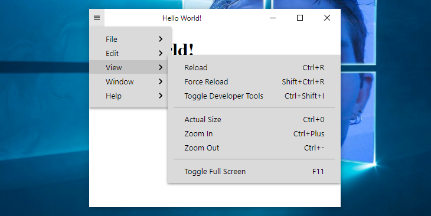

# custom-titlebar

Poorly coded titlebar for [Electron](https://www.electronjs.org/) and [NW.js](https://nwjs.io/)

  


> Light/Dark skin



> Condensed menu

# About

## Main features

* Compatible with any version of Electron 🎉
* Works with Electron, NW.js and probably others 🤷‍♂️
* Works without any dependency, so it won't break in the next major release of Electron 👀
* Very small footprint (< 20 kB) 👣
* Options and methods very similar to [custom-electron-titlebar](https://www.npmjs.com/package/custom-electron-titlebar) 📖

## Inpiration

This package is highly inspired by [custom-electron-titlebar](https://www.npmjs.com/package/custom-electron-titlebar).

## Motivations

I needed a custom titlebar for Electron 14 to replace the unmaintened [custom-electron-titlebar](https://www.npmjs.com/package/custom-electron-titlebar), but I couldn't find any interesting ones, so I made it myself.

## Not yet implemented

* MenuItem role, icon, radio
* Icons theme
* Submenu scrollbar

# Install

```
npm i @6c65726f79/custom-titlebar
```

# Usage

```
// JavaScript

const Titlebar = require('@6c65726f79/custom-titlebar');

new Titlebar({
  backgroundColor: '#000'
});
```

```
// TypeScript

import { Titlebar } from '@6c65726f79/custom-titlebar'

new Titlebar({
  backgroundColor: '#000'
});
```

# Examples

## Electron

### Without context isolation

Use context isolation. ¯\\_(ツ)_/¯

### With context isolation

```
// main.js

const { app, BrowserWindow } = require('electron');
require('@electron/remote/main').initialize();
const path = require('path');

function createWindow () {
  const win = new BrowserWindow({
    width: 800,
    height: 600,
    frame: false,
    titleBarStyle: 'hidden',
    webPreferences: {
      contextIsolation: true,
      preload: path.join(__dirname, 'preload.js')
    }
  })
  
  win.loadFile('index.html');

  return win;
}

app.whenReady().then(() => {
  const mainWindow = createWindow();
  require('@electron/remote/main').enable(mainWindow.webContents);
})
```

```
// preload.js

const { Menu, getCurrentWindow } = require('@electron/remote');
const Titlebar = require('@6c65726f79/custom-titlebar');

const currentWindow = getCurrentWindow();
let titlebar;

currentWindow.webContents.once('dom-ready', () => {
  titlebar = new Titlebar({
    menu: Menu.getApplicationMenu(),
    backgroundColor: '#37474f',
    onMinimize: () => currentWindow.minimize(),
    onMaximize: () => currentWindow.isMaximized() ? currentWindow.unmaximize() : currentWindow.maximize(),
    onClose: () => currentWindow.close(),
    isMaximized: () => currentWindow.isMaximized()
  });
});
```

## NW.js

```
// package.json

{
  "name": "helloworld",
  "main": "index.html",
  "window": {
    "frame": false,
    "toolbar": false
  },
  "dependencies": {
    "@6c65726f79/custom-titlebar": "^0.1.2"
  }
}
```

```
// index.html

<!DOCTYPE html>
<html>
  <head>
    <title>Hello World!</title>
    <script src="./node_modules/@6c65726f79/custom-titlebar/lib/index.js"></script> 
  </head>
  <body>
    <h1>Hello World!</h1>
    <script>
      const gui = require('nw.gui');
      const win = gui.Window.get();
      let maximized = false;

      win.onMaximized.addListener(() => { maximized=true; });
      win.onRestore.addListener(() => { maximized=false; });

      const titlebar = new Titlebar({
        backgroundColor: '#37474f',
        onMinimize: () => win.minimize(),
        onMaximize: () => maximized ? win.restore() : win.maximize(),
        onClose: () => win.close(),
        isMaximized: () => maximized
      });
    </script>
  </body>
</html>
```

# Options

All parameters are optional.

| Parameter                | Type       | Description                                                                | Default |
| ------------------------ | ---------- | -------------------------------------------------------------------------- | ------- |
| backgroundColor          | `string`   | The background color of the titlebar.                                      | #FFFFFF |
| condensed                | `boolean`  | Force the menu bar to be condensed.                                        | false   |
| drag                     | `boolean`  | Define whether or not you can drag the window.                             | true    |
| icon                     | `string`   | The icon of the titlebar.                                                  | null    |
| isMaximized              | `function` | A function that return `true` or `false` if the window is maximized or not.| null    |
| menu                     | `object`   | List of MenuItem to show in the menu bar. ([Electron](https://www.electronjs.org/docs/api/menu-item) or [NW.js](https://docs.nwjs.io/en/latest/References/MenuItem/)) | null  |
| onClose                  | `function` | The function to call when the close button is clicked.                     | null    |
| onMaximize               | `function` | The function to call when the maximize/restore button is clicked.          | null    |
| onMinimize               | `function` | The function to call when the minimize button is clicked.                  | null    |
| overflow                 | `string`   | The overflow of the container. (`auto`, `visible`, `hidden`)               | auto    |
| titleHorizontalAlignment | `string`   | Set horizontal alignment of the window title. (`left`, `center`, `right`)  | center  |

# Methods

## Update options

This method updates all parameters that are specified.

```
titlebar.updateOptions({
  condensed: 'true',
  titleHorizontalAlignment: 'left'
});
```

## Update background

This change the color of titlebar and it's checked whether the color is light or dark, so that the color of the icons adapts to the background of the titlebar. The value must be a valid CSS color.

```
titlebar.updateBackground('rgb(60, 60, 60)');
```

## Update title

This method update the title of the titlebar. If you change the content of the title tag, you should call this method to update the title.

```
document.title = 'My new title';
titlebar.updateTitle();

// Or you can do as follows and avoid writing document.title
titlebar.updateTitle('New Title');
```

## Update icon

With this method you can update the icon. This method receives the url of an image or an image encoded in base64.

```
titlebar.updateIcon('data:image/png;base64,iVBORw0KGgoAAAANSUhEUgAAABAAAAAQCAYAAAAf8/9hAAAACXBIWXMAAAsTAAALEwEAmpwYAAAAIGNIUk0AAHolAACAgwAA+f8AAIDpAAB1MAAA6mAAADqYAAAXb5JfxUYAAAM8SURBVHjaPMzNaxxlHMDx7++ZZ2dfZjcvmjUvbd6axlZtVBJFEPEklYI3qQiKCr1bEEEontuTokcvVZRWREGhOdSCiK+9aECQ1Jg0qWmMm2w22czMzvs840n/gM9Hzn/wOM0jUE2niFPDTmudW6sbTFQe4OIzb81/uvjtqT915+O76keGhx2ceohdjmjUZ6iWx9FKC4XEY3F6+4wbdp9eb90Z2rhrNpfcmxfm+Hx6a5/Z6zvfoButk16m7OmJxuZoo7+rlAUFyAtvLxD7m+/d+bt9/p4+YWF8gamhhzh0PZKu9VW3o35zhrNXjk8enQ6kwx+9X9n0bl179NhjZ5sD87G8f+k10jhnMEy/fnao7/SR2QkYGQRdUIRenrZ9sZ2GolIFGiAW170lPlz+6HK9VjknxRdXoH/gZYK1T1j9DjIXGg5Fw0F0AfUG2T8+SpdRRQ5dD449ydqJk1dbuvOSOjRps9daeSdZ+oG81SX3DCZIwQ8pkgLsClm1RBTHMHgvRoT0py+ZabVffOr+V+e0cqqn862d+9g9IIt8xAalDJYliAKCEMupEaytUet3oK9M3iqR/fK9Kk3OPqeTzv68eCF5L4NehFQ11mGC1hqRAoljdL1KlhuS3V1sp4SqaGIvRG1vTGkT9ApjBIlyTJgBBcqHklZYJQsJIizxSJOc5NBHSxmTp2RJis5Mro1VuZkqG5MBCZgio7AMJQtKtmCVBCtKCA5DHKNIyxaJG5FWNNVyZVlLni3m1b6VUNdOSLgDgcEYIdaGsoBlDHmjwN33Gao4JF5M0AmRuWbLstRnKgn9mFrt9Xh0EtdYRL2YxM/ouQl+NyDzIw72fCI/RAS8VhePOsXAwJv++u22SlAAN/T4zLlgfIYuitBLyDxD5KfksaG97UIQ4rZ9tjqKZGTyYrTXudL5fQUtCGQpyrIu69lTu14QXwu31ygFGTYa7yBhb/uASpKxEgxhj41f6K/qS7nvURQFGgARiiTBUrKoRo+O9Gx9I3A7D1eCDulfexgjeMefcMvN8TMNJ/2Z1Ee0jfwfACJCkedIGu9Q73tEDY89L72DN7zV5SozD161mpPvluKeKdIYbPmP8e8AOU+pc9F7CmgAAAAASUVORK5CYII=');
```

## Update menu

This method updates or creates the menu. You can use an array of MenuItem from [Electron](https://www.electronjs.org/docs/api/menu-item)/[NW.js](https://docs.nwjs.io/en/latest/References/MenuItem/), or directly `Menu.getApplicationMenu()` in Electron.

```
// With a menu template
titlebar.updateMenu([
  {
    label: 'Item 1',
    submenu: [
      {
        label: 'Subitem 1',
        click: () => console.log('Clicked on subitem 1')
      },
      {
        type: 'separator'
      },
      {
        label: 'Subitem 2',
        click: () => console.log('Clicked on subitem 2')
      },
    ]
  },
  {
    label: 'Item 2',
    submenu: [
      {
        label: 'Subitem checkbox',
        type: 'checkbox',
        checked: true
      },
      {
        type: 'separator'
      },
      {
        label: 'Subitem with submenu',
        submenu: [
          {
            label: 'Submenu item 1',
            accelerator: 'Ctrl+T'
          }
        ]
      }
    ]
  }
]);

// Or with getApplicationMenu in Electron
titlebar.updateMenu(Menu.getApplicationMenu());
```

## Update horizontal alignment

This method updates the horizontal alignment of the window title. `left`, `center` and `right` are allowed.

```
titlebar.updateHorizontalAlignment('right');
```

## Dispose

This method removes the titlebar completely and all recorded events.

```
titlebar.dispose();
```

# CSS Class

You can use the CSS class `.custom-titlebar-container` to customize the container under the titlebar.

----

Made with love and fun from France ❤